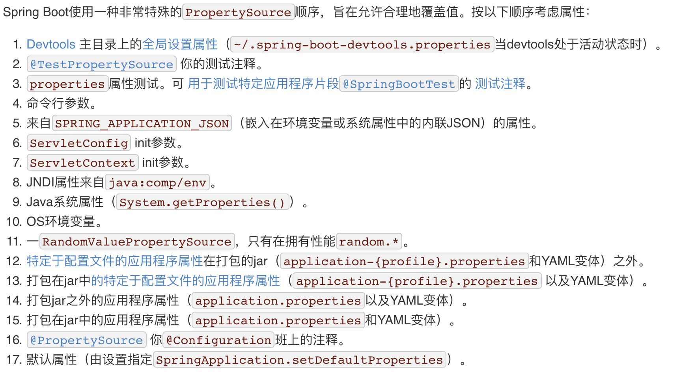

# Spring Boot配置文件

## 1、配置文件

Spring Boot使用全局配置文件，配置文件名是固定的

- application.properties
- application.yml


配置文件的作用：修改Spring Boot自动配置的默认值


yaml：**以数据为中心**，比json，xml更适合做配置语言

```yaml
server:
  port: 8081
```

xml实例：

```xml
<server>
	<port>8081</port>
</server>
```

## 2、YAML的语法

### 1、基本语法

k:(空格) v : 表示一对键值对（空格必须有）；

以==空格==的缩紧控制层级关系，只要左对齐的一列数据，都是同一个层级的；

```yaml
server:
  port: 8081
  path: /hello
```

属性和值大小写敏感；

### 2、值的写法

#### 字面量：普通的值（数字，字符串，布尔）

​		k: v : 字面直接写；

​				 字符串默认不用加上单引号或双引号；

​				 ""：双引号：不会转义字符串里面的特殊字符，特殊字符会做为它本身想表示的意思

​							name:	"wang \n li"	输出：wang 换行 li

​				 ' '：单引号：会转义特殊字符串，特殊字符最终只是一个普通的字符串数据

​							name:	'wang \n li'	输出：wang \n li

#### 对象（属性和值）（键值对）：

​		对象还是k: v : 在下一行写对象的属性和值的关系，注意缩紧

```yaml
friends:
    lastName: allen
    age: 20
```

 		行内写法：

```yaml
friends: {lastName: allen, age: 20}
```

#### 数组（List，Set）：

 		用- 值表示数组中的一个元素：

```yaml
pets:
    - cat
    - dog
    - pig
```

​		行内写法

```yaml
pets: [cat,dog,pig]
```

## 3、配置文件值注入 

配置文件

```yaml
persion:
  lastName: allen
  age: 20
  boss: false
  birthday: 2019/04/20
  maps: {k1: v1,k2: v2,k3: v3}
  lists:
    - 1
    - 2
    - 3
  dog:
    name: 哈士奇
    age: 3
```

javaBean:

```java
/**
 * 将配置文件中配置的每一个属性的值，映射到这个组件中
 * @ConfigurationProperties：告诉SpringBoot将本类中到所有属性和配置文件中相关到配置进行绑定
 *      prefix = "persion" 配置文件中哪个下面到所有属性进行一一映射
 * 只有这个组件是容器中到组件，才能使用容器提供的@ConfigurationProperties功能
 */
@Component
@ConfigurationProperties(prefix = "persion")
public class Person {
    private String lastName;
    private Integer age;
    private boolean boss;
    private Date birthday;

    private Map<String,Object> maps;
    private List<Object> lists;
    private Dog dog;
}
```

导入配置文件处理器，编写配置的就会有提示

```xml
<!--绑定配置文件处理器，配置文件进行绑定后就会有提示-->
<dependency>
    <groupId>org.springframework.boot</groupId>
    <artifactId>spring-boot-configuration-processor</artifactId>
    <optional>true</optional>
</dependency>
```

### 1、properties配置文件在idea中默认utf-8可能会乱码


### 2、@Value和@ConfigurationProperties获取值比较

|                      | @ConfigurationProperties |   @Value   |
| -------------------- | :----------------------: | :--------: |
| 功能                 | 批量注入配置文件中的属性 | 一个个指定 |
| 松散绑定（松散语法） |           支持           |   不支持   |
| SpEL                 |          不支持          |    支持    |
| JSR303数据校验       |           支持           |   不支持   |
| 复杂类型封装         |           支持           |   不支持   |

配置文件yml和properties它们都能获取到值；

==如果只是在某个业务逻辑中获取一下配置文件中的某个值，使用@Value;==

==如果专门编写了一个JavaBean来和配置文件进行映射，使用@ConfigurationProperties；==

### 3、配置文件注入值数据校验

```java
/**
 * 将配置文件中配置的每一个属性的值，映射到这个组件中
 * @ConfigurationProperties：告诉SpringBoot将本类中到所有属性和配置文件中相关到配置进行绑定
 *      prefix = "persion" 配置文件中哪个下面到所有属性进行一一映射
 * 只有这个组件是容器中到组件，才能使用容器提供的@ConfigurationProperties功能
 */
@Component
@ConfigurationProperties(prefix = "persion")
@Validated
public class Person {

    /**
     * <bean class="Person">
     *     <property name="lastName" value="字面量/${key}从环境变量或配置文件中获取值/#{SpEL Spring表达式语言}"></property>
     * </bean>
     */
//    @Value("${person.lastName:}")
    @Email
    private String lastName;
//    @Value("#{10*2}")
    private Integer age;
//    @Value("true")
    private boolean boss;
    private Date birthday;

    private Map<String,Object> maps;
    private List<Object> lists;
    private Dog dog;
}
```

### 4、@PropertySource和@ImportResource

@**PropertySource**：加载指定的配置文件

```java
/**
 * 将配置文件中配置的每一个属性的值，映射到这个组件中
 * @ConfigurationProperties：告诉SpringBoot将本类中到所有属性和配置文件中相关到配置进行绑定
 *      prefix = "persion" 配置文件中哪个下面到所有属性进行一一映射
 * 只有这个组件是容器中到组件，才能使用容器提供的@ConfigurationProperties功能
 * @ConfigurationProperties(prefix = "person") 默认从全局配置文件中获取值
 */
@PropertySource(value = {"classpath:person.yml"})
@Component
@ConfigurationProperties(prefix = "person")
@Validated
public class Person {

    /**
     * <bean class="Person">
     *     <property name="lastName" value="字面量/${key}从环境变量或配置文件中获取值/#{SpEL Spring表达式语言}"></property>
     * </bean>
     */
//    @Value("${person.lastName:}")
//    @Email
    private String lastName;
//    @Value("#{10*2}")
    private Integer age;
//    @Value("true")
    private boolean boss;
    private Date birthday;

    private Map<String,Object> maps;
    private List<Object> lists;
    private Dog dog;
}
```

@**ImportResource**：导入Spring的配置文件，让配置文件里面的内容生效；

Spring Boot里面没有Spring的配置文件 ，自己编写的配置文件也不能自动识别；

想让Spring的配置文件生效，加载进来，把@**ImportResource**标注在==主配置类==上

```java
//导入Spring的配置文件让其生效
@ImportResource(locations = {"classpath:beans.xml"})
```

Spring Boot中不推荐编写Spring配置文件

```xml
<?xml version="1.0" encoding="UTF-8"?>
<beans xmlns="http://www.springframework.org/schema/beans"
       xmlns:xsi="http://www.w3.org/2001/XMLSchema-instance"
       xsi:schemaLocation="http://www.springframework.org/schema/beans http://www.springframework.org/schema/beans/spring-beans.xsd">

    <bean id="helloService" class="com.allen.springboot.service.HelloService"></bean>
</beans>
```

Spring Boot推荐给容器中添加组件的方式，使用全注解的方式

1、配置类===Spring配置文件

2、使用@Bean给容器中添加组件

```java
/**
 * @Configuration：指明当前类是一个配置类，就是来替代Spring配置文件
 * 在配置文件中用<bean></bean>标签添加组件
 */
@Configuration
public class MyAppConfig {

    //将方法的返回值添加到容器中，容器中这个组件默认的ID就是方法名
    @Bean
    public HelloService helloService(){
        System.out.println("配置类@Bean给容器中添加组件了。。。");
        return new HelloService();
    }
}
```


## 4、配置文件占位符

### 1、随机数

```java
{random.value}、${random.int}、${random.long}、${random.int(10)}、${random.int[123,321]}
```

### 2、占位符获取以前配置的值，如果没有可以使用：指定默认值

```yaml
person:
  lastName: allen${random.uuid}
  age: ${random.int}
  boss: false
  birthday: 2019/04/20
  maps: {k1: v1,k2: v2,k3: v3}
  lists:
    - 1
    - 2
    - 3
  dog:
    name: ${person.hello:hello}-dog
    age: 3
```

## 5、Profile

### 1、多Profile文件

在主配置文件编写的时候，文件名可以是application-{profile}.properties/yml；

默认使用application.properties的配置文件

### 2、yml支持多文档块方式

```yaml
server:
  port: 8081
spring:
  profiles:
    active: prod
---
server:
  port: 8082
spring:
  profiles: dev
---
server:
  port: 8083
spring:
  profiles: prod
```

### 3、激活指定profile

- 在配置文件中指定激活application-dev.yml文件

	```yaml
	spring:
	  profiles:
	    active: dev
	```

- 命令行：

	```cmd
	--spring.profiles.active=dev
	```

- 虚拟机参数

	```cmd
	-Dspring.profiles.active=dev
	```

## 6、配置文件加载位置

Spring Boot启动会扫描application.properties/yml文件做为Spring Boot默认配置文件

优先级：由高到低

- file: ./config/application.properties
- file: ./application.properties
- classpath: ./config/application.properties
- classpath: ./application.properties

高优先级的配置会覆盖低优先级的配置；

Spring Boot会从这四个位置全部加载配置文件，**互补配置**；

**可以通过spring.config.location改变默认的配置文件路径；**

项目打包后可以使用命令行参数的形式，启动项目的时候指定配置文件的新路径，指定的配置文件和默认加载的配置文件都会起作用，形成互补配置；

## 7、外部配置加载顺序

**所有的配置会形成互补配置；**



## 8、自动配置原理

[配置能配置的文件属性参照](https://docs.spring.io/spring-boot/docs/2.1.4.RELEASE/reference/htmlsingle/#common-application-properties)

### **1、自动配置原理：**

1. Spring Boot启动的时候加载主配置类，开启了自动配置功能**@EnableAutoConfiguration**；

2. @EnableAutoConfiguration的作用：

	- 利用AutoConfigurationImportSelector给容器中导入一些组件；

	- 可以查看selectImports()方法的内容；

	- 获取候选的配置：

	1. ```java
		List<String> configurations = getCandidateConfigurations(annotationMetadata,
		      attributes);
		```

		```java
		SpringFactoriesLoader.loadFactoryNames()
		# 扫描所有jar包下的 META-INF/spring.factories
		把扫描到的文件的内容包装成properties对象
		从properties中获取到EnableAutoConfiguration.class类（类名）对应的值，然后把它们添加在容器中
		```

	- **将类路径下 META-INF/spring.factories 里面配置的所有EnableAutoConfiguration的值加入到了容器中；**

		```properties
		# Auto Configure
		org.springframework.boot.autoconfigure.EnableAutoConfiguration=\
		org.springframework.boot.autoconfigure.admin.SpringApplicationAdminJmxAutoConfiguration,\
		org.springframework.boot.autoconfigure.aop.AopAutoConfiguration,\
		org.springframework.boot.autoconfigure.amqp.RabbitAutoConfiguration,\
		org.springframework.boot.autoconfigure.batch.BatchAutoConfiguration,\
		org.springframework.boot.autoconfigure.cache.CacheAutoConfiguration,\
		org.springframework.boot.autoconfigure.cassandra.CassandraAutoConfiguration,\
		org.springframework.boot.autoconfigure.cloud.CloudServiceConnectorsAutoConfiguration,\
		org.springframework.boot.autoconfigure.context.ConfigurationPropertiesAutoConfiguration,\
		org.springframework.boot.autoconfigure.context.MessageSourceAutoConfiguration,\
		org.springframework.boot.autoconfigure.context.PropertyPlaceholderAutoConfiguration,\
		org.springframework.boot.autoconfigure.couchbase.CouchbaseAutoConfiguration,\
		org.springframework.boot.autoconfigure.dao.PersistenceExceptionTranslationAutoConfiguration,\
		org.springframework.boot.autoconfigure.data.cassandra.CassandraDataAutoConfiguration,\
		org.springframework.boot.autoconfigure.data.cassandra.CassandraReactiveDataAutoConfiguration,\
		org.springframework.boot.autoconfigure.data.cassandra.CassandraReactiveRepositoriesAutoConfiguration,\
		org.springframework.boot.autoconfigure.data.cassandra.CassandraRepositoriesAutoConfiguration,\
		org.springframework.boot.autoconfigure.data.couchbase.CouchbaseDataAutoConfiguration,\
		org.springframework.boot.autoconfigure.data.couchbase.CouchbaseReactiveDataAutoConfiguration,\
		org.springframework.boot.autoconfigure.data.couchbase.CouchbaseReactiveRepositoriesAutoConfiguration,\
		org.springframework.boot.autoconfigure.data.couchbase.CouchbaseRepositoriesAutoConfiguration,\
		org.springframework.boot.autoconfigure.data.elasticsearch.ElasticsearchAutoConfiguration,\
		org.springframework.boot.autoconfigure.data.elasticsearch.ElasticsearchDataAutoConfiguration,\
		org.springframework.boot.autoconfigure.data.elasticsearch.ElasticsearchRepositoriesAutoConfiguration,\
		org.springframework.boot.autoconfigure.data.jdbc.JdbcRepositoriesAutoConfiguration,\
		org.springframework.boot.autoconfigure.data.jpa.JpaRepositoriesAutoConfiguration,\
		org.springframework.boot.autoconfigure.data.ldap.LdapRepositoriesAutoConfiguration,\
		org.springframework.boot.autoconfigure.data.mongo.MongoDataAutoConfiguration,\
		org.springframework.boot.autoconfigure.data.mongo.MongoReactiveDataAutoConfiguration,\
		org.springframework.boot.autoconfigure.data.mongo.MongoReactiveRepositoriesAutoConfiguration,\
		org.springframework.boot.autoconfigure.data.mongo.MongoRepositoriesAutoConfiguration,\
		org.springframework.boot.autoconfigure.data.neo4j.Neo4jDataAutoConfiguration,\
		org.springframework.boot.autoconfigure.data.neo4j.Neo4jRepositoriesAutoConfiguration,\
		org.springframework.boot.autoconfigure.data.solr.SolrRepositoriesAutoConfiguration,\
		org.springframework.boot.autoconfigure.data.redis.RedisAutoConfiguration,\
		org.springframework.boot.autoconfigure.data.redis.RedisReactiveAutoConfiguration,\
		org.springframework.boot.autoconfigure.data.redis.RedisRepositoriesAutoConfiguration,\
		org.springframework.boot.autoconfigure.data.rest.RepositoryRestMvcAutoConfiguration,\
		org.springframework.boot.autoconfigure.data.web.SpringDataWebAutoConfiguration,\
		org.springframework.boot.autoconfigure.elasticsearch.jest.JestAutoConfiguration,\
		org.springframework.boot.autoconfigure.elasticsearch.rest.RestClientAutoConfiguration,\
		org.springframework.boot.autoconfigure.flyway.FlywayAutoConfiguration,\
		org.springframework.boot.autoconfigure.freemarker.FreeMarkerAutoConfiguration,\
		org.springframework.boot.autoconfigure.gson.GsonAutoConfiguration,\
		org.springframework.boot.autoconfigure.h2.H2ConsoleAutoConfiguration,\
		org.springframework.boot.autoconfigure.hateoas.HypermediaAutoConfiguration,\
		org.springframework.boot.autoconfigure.hazelcast.HazelcastAutoConfiguration,\
		org.springframework.boot.autoconfigure.hazelcast.HazelcastJpaDependencyAutoConfiguration,\
		org.springframework.boot.autoconfigure.http.HttpMessageConvertersAutoConfiguration,\
		org.springframework.boot.autoconfigure.http.codec.CodecsAutoConfiguration,\
		org.springframework.boot.autoconfigure.influx.InfluxDbAutoConfiguration,\
		org.springframework.boot.autoconfigure.info.ProjectInfoAutoConfiguration,\
		org.springframework.boot.autoconfigure.integration.IntegrationAutoConfiguration,\
		org.springframework.boot.autoconfigure.jackson.JacksonAutoConfiguration,\
		org.springframework.boot.autoconfigure.jdbc.DataSourceAutoConfiguration,\
		org.springframework.boot.autoconfigure.jdbc.JdbcTemplateAutoConfiguration,\
		org.springframework.boot.autoconfigure.jdbc.JndiDataSourceAutoConfiguration,\
		org.springframework.boot.autoconfigure.jdbc.XADataSourceAutoConfiguration,\
		org.springframework.boot.autoconfigure.jdbc.DataSourceTransactionManagerAutoConfiguration,\
		org.springframework.boot.autoconfigure.jms.JmsAutoConfiguration,\
		org.springframework.boot.autoconfigure.jmx.JmxAutoConfiguration,\
		org.springframework.boot.autoconfigure.jms.JndiConnectionFactoryAutoConfiguration,\
		org.springframework.boot.autoconfigure.jms.activemq.ActiveMQAutoConfiguration,\
		org.springframework.boot.autoconfigure.jms.artemis.ArtemisAutoConfiguration,\
		org.springframework.boot.autoconfigure.groovy.template.GroovyTemplateAutoConfiguration,\
		org.springframework.boot.autoconfigure.jersey.JerseyAutoConfiguration,\
		org.springframework.boot.autoconfigure.jooq.JooqAutoConfiguration,\
		org.springframework.boot.autoconfigure.jsonb.JsonbAutoConfiguration,\
		org.springframework.boot.autoconfigure.kafka.KafkaAutoConfiguration,\
		org.springframework.boot.autoconfigure.ldap.embedded.EmbeddedLdapAutoConfiguration,\
		org.springframework.boot.autoconfigure.ldap.LdapAutoConfiguration,\
		org.springframework.boot.autoconfigure.liquibase.LiquibaseAutoConfiguration,\
		org.springframework.boot.autoconfigure.mail.MailSenderAutoConfiguration,\
		org.springframework.boot.autoconfigure.mail.MailSenderValidatorAutoConfiguration,\
		org.springframework.boot.autoconfigure.mongo.embedded.EmbeddedMongoAutoConfiguration,\
		org.springframework.boot.autoconfigure.mongo.MongoAutoConfiguration,\
		org.springframework.boot.autoconfigure.mongo.MongoReactiveAutoConfiguration,\
		org.springframework.boot.autoconfigure.mustache.MustacheAutoConfiguration,\
		org.springframework.boot.autoconfigure.orm.jpa.HibernateJpaAutoConfiguration,\
		org.springframework.boot.autoconfigure.quartz.QuartzAutoConfiguration,\
		org.springframework.boot.autoconfigure.reactor.core.ReactorCoreAutoConfiguration,\
		org.springframework.boot.autoconfigure.security.servlet.SecurityAutoConfiguration,\
		org.springframework.boot.autoconfigure.security.servlet.SecurityRequestMatcherProviderAutoConfiguration,\
		org.springframework.boot.autoconfigure.security.servlet.UserDetailsServiceAutoConfiguration,\
		org.springframework.boot.autoconfigure.security.servlet.SecurityFilterAutoConfiguration,\
		org.springframework.boot.autoconfigure.security.reactive.ReactiveSecurityAutoConfiguration,\
		org.springframework.boot.autoconfigure.security.reactive.ReactiveUserDetailsServiceAutoConfiguration,\
		org.springframework.boot.autoconfigure.sendgrid.SendGridAutoConfiguration,\
		org.springframework.boot.autoconfigure.session.SessionAutoConfiguration,\
		org.springframework.boot.autoconfigure.security.oauth2.client.servlet.OAuth2ClientAutoConfiguration,\
		org.springframework.boot.autoconfigure.security.oauth2.client.reactive.ReactiveOAuth2ClientAutoConfiguration,\
		org.springframework.boot.autoconfigure.security.oauth2.resource.servlet.OAuth2ResourceServerAutoConfiguration,\
		org.springframework.boot.autoconfigure.security.oauth2.resource.reactive.ReactiveOAuth2ResourceServerAutoConfiguration,\
		org.springframework.boot.autoconfigure.solr.SolrAutoConfiguration,\
		org.springframework.boot.autoconfigure.task.TaskExecutionAutoConfiguration,\
		org.springframework.boot.autoconfigure.task.TaskSchedulingAutoConfiguration,\
		org.springframework.boot.autoconfigure.thymeleaf.ThymeleafAutoConfiguration,\
		org.springframework.boot.autoconfigure.transaction.TransactionAutoConfiguration,\
		org.springframework.boot.autoconfigure.transaction.jta.JtaAutoConfiguration,\
		org.springframework.boot.autoconfigure.validation.ValidationAutoConfiguration,\
		org.springframework.boot.autoconfigure.web.client.RestTemplateAutoConfiguration,\
		org.springframework.boot.autoconfigure.web.embedded.EmbeddedWebServerFactoryCustomizerAutoConfiguration,\
		org.springframework.boot.autoconfigure.web.reactive.HttpHandlerAutoConfiguration,\
		org.springframework.boot.autoconfigure.web.reactive.ReactiveWebServerFactoryAutoConfiguration,\
		org.springframework.boot.autoconfigure.web.reactive.WebFluxAutoConfiguration,\
		org.springframework.boot.autoconfigure.web.reactive.error.ErrorWebFluxAutoConfiguration,\
		org.springframework.boot.autoconfigure.web.reactive.function.client.ClientHttpConnectorAutoConfiguration,\
		org.springframework.boot.autoconfigure.web.reactive.function.client.WebClientAutoConfiguration,\
		org.springframework.boot.autoconfigure.web.servlet.DispatcherServletAutoConfiguration,\
		org.springframework.boot.autoconfigure.web.servlet.ServletWebServerFactoryAutoConfiguration,\
		org.springframework.boot.autoconfigure.web.servlet.error.ErrorMvcAutoConfiguration,\
		org.springframework.boot.autoconfigure.web.servlet.HttpEncodingAutoConfiguration,\
		org.springframework.boot.autoconfigure.web.servlet.MultipartAutoConfiguration,\
		org.springframework.boot.autoconfigure.web.servlet.WebMvcAutoConfiguration,\
		org.springframework.boot.autoconfigure.websocket.reactive.WebSocketReactiveAutoConfiguration,\
		org.springframework.boot.autoconfigure.websocket.servlet.WebSocketServletAutoConfiguration,\
		org.springframework.boot.autoconfigure.websocket.servlet.WebSocketMessagingAutoConfiguration,\
		org.springframework.boot.autoconfigure.webservices.WebServicesAutoConfiguration,\
		org.springframework.boot.autoconfigure.webservices.client.WebServiceTemplateAutoConfiguration
		```

	- 每一个这样的xxxAutoConfiguration类都是容器中的一个组件，都加入到容器中，用它们做自动配置；

3. 每一个自动配置类进行自动配置功能;

4. 以**HttpEncodingAutoConfiguration**为例解释自动配置

	```java
	@Configuration //表示这是一个配置类
	@EnableConfigurationProperties(HttpProperties.class) //启动指定类的ConfigurationProperties功能，将配置文件中能配置的值和HttpProperties绑定，并把HttpProperties加入到ioc容器中
	@ConditionalOnWebApplication(type = ConditionalOnWebApplication.Type.SERVLET) //Spring底层@Conditional注解，根据不同的条件，如果满足指定的条件，整个配置类里面的配置才会生效；判断当前应用是否是web应用
	@ConditionalOnClass(CharacterEncodingFilter.class) //判断当前项目有没有CharacterEncodingFilter这个类；SpringMVC中解决乱码的过滤器
	@ConditionalOnProperty(prefix = "spring.http.encoding", value = "enabled",
	      matchIfMissing = true) //判断配置文件中是否存在某个配置；spring.http.encoding.enabled;如果不存在，判断也成立；
	//即使配置文件中不配置spring.http.encoding.enabled=true；默认也是生效的
	public class HttpEncodingAutoConfiguration {
	   //它已经和Spring Boot的配置文件映射
	   private final HttpProperties.Encoding properties;
	   //只有一个有参构造器的情况下，参数的值就会从容器中拿
	   public HttpEncodingAutoConfiguration(HttpProperties properties) {
	      this.properties = properties.getEncoding();
	   }
	   @Bean //给容器中添加一个组件，这个组件的某些值需要从properties中获取
	   @ConditionalOnMissingBean //判断容器中没有这个组件
	   public CharacterEncodingFilter characterEncodingFilter() {
	      CharacterEncodingFilter filter = new OrderedCharacterEncodingFilter();
	      filter.setEncoding(this.properties.getCharset().name());
	      filter.setForceRequestEncoding(this.properties.shouldForce(Type.REQUEST));
	      filter.setForceResponseEncoding(this.properties.shouldForce(Type.RESPONSE));
	      return filter;
	   }
	```

	根据当前不同的条件判断，决定这个配置类是否生效；

	一旦配置类生效，配置类就会给容器中添加各种组件，这些组件的属性是从对应的properties类中获取的，这些类里面的每一个属性是和配置文件绑定的。

5. 所有在配置文件中能配置的属性都是在xxxProperties类中封装着

	```java
	@ConfigurationProperties(prefix = "spring.http") //从配置文件中获取指定的值和bean的属性进行绑定
	public class HttpProperties {
	}
	```

### 2、精髓：

- **Spring Boot启动会加载大量的自动配置类**
- **需要的功能看有没有Spring Boot写好的自动配置类**
- **看自动配置类中配置了哪些组件（只要用的有，就不需要再配置）**
- **给容器中自动配置类添加组件的时候，会从properties类中获取某些属性，就可以在配置文件中指定这些属性的值**

### 3、细节：

#### 1、@Conditional派生注解（Spring注解版源生的@Conditional作用）

作用：必须给@Conditional指定的条件成立，才给容器中添加组件，配置里面的所有内容才生效

自动配置类必须在一定的条件下才能生效；

可以通过debug=true属性，让控制台输出自动配置报告，就可以知道哪些自动配置类生效