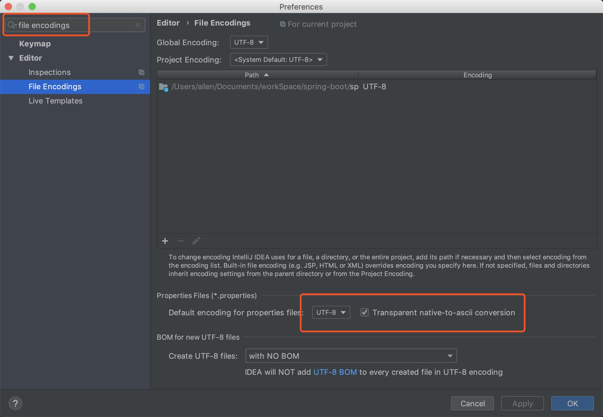

# Spring Boot配置文件

## 1、配置文件

Spring Boot使用全局配置文件，配置文件名是固定的

- application.properties
- application.yml


配置文件的作用：修改Spring Boot自动配置的默认值


yaml：**以数据为中心**，比json，xml更适合做配置语言

```yaml
server:
  port: 8081
```

xml实例：

```xml
<server>
	<port>8081</port>
</server>
```

## 2、YAML的语法

### 1、基本语法

k:(空格) v : 表示一对键值对（空格必须有）；

以==空格==的缩紧控制层级关系，只要左对齐的一列数据，都是同一个层级的；

```yaml
server:
	port: 8081
	path: /hello
```

属性和值大小写敏感；

### 2、值的写法

#### 字面量：普通的值（数字，字符串，布尔）

​		k: v : 字面直接写；

​				 字符串默认不用加上单引号或双引号；

​				 ""：双引号：不会转义字符串里面的特殊字符，特殊字符会做为它本身想表示的意思

​							name:	"wang \n li"	输出：wang 换行 li

​				 ' '：单引号：会转义特殊字符串，特殊字符最终只是一个普通的字符串数据

​							name:	'wang \n li'	输出：wang \n li

#### 对象（属性和值）（键值对）：

​		对象还是k: v : 在下一行写对象的属性和值的关系，注意缩紧

```yaml
friends:
    lastName: allen
    age: 20
```

 		行内写法：

```yaml
friends: {lastName: allen, age: 20}
```

#### 数组（List，Set）：

 		用- 值表示数组中的一个元素：

```yaml
pets:
	- cat
	- dog
	- pig
```

​		行内写法

```yaml
pets: [cat,dog,pig]
```

## 3、配置文件值注入 

配置文件

```yaml
persion:
  lastName: allen
  age: 20
  boss: false
  birthday: 2019/04/20
  maps: {k1: v1,k2: v2,k3: v3}
  lists:
    - 1
    - 2
    - 3
  dog:
    name: 哈士奇
    age: 3
```

javaBean:

```java
/**
 * 将配置文件中配置的每一个属性的值，映射到这个组件中
 * @ConfigurationProperties：告诉SpringBoot将本类中到所有属性和配置文件中相关到配置进行绑定
 *      prefix = "persion" 配置文件中哪个下面到所有属性进行一一映射
 * 只有这个组件是容器中到组件，才能使用容器提供的@ConfigurationProperties功能
 */
@Component
@ConfigurationProperties(prefix = "persion")
public class Person {
    private String lastName;
    private Integer age;
    private boolean boss;
    private Date birthday;

    private Map<String,Object> maps;
    private List<Object> lists;
    private Dog dog;
}
```

导入配置文件处理器，编写配置的就会有提示

```xml
<!--绑定配置文件处理器，配置文件进行绑定后就会有提示-->
<dependency>
    <groupId>org.springframework.boot</groupId>
    <artifactId>spring-boot-configuration-processor</artifactId>
    <optional>true</optional>
</dependency>
```

#### 1、properties配置文件在idea中默认utf-8可能会乱码



#### 2、@Value和@ConfigurationProperties获取值比较

|                      | @ConfigurationProperties |   @Value   |
| -------------------- | :----------------------: | :--------: |
| 功能                 | 批量注入配置文件中的属性 | 一个个指定 |
| 松散绑定（松散语法） |           支持           |   不支持   |
| SpEL                 |          不支持          |    支持    |
| JSR303数据校验       |           支持           |   不支持   |
| 复杂类型封装         |           支持           |   不支持   |

配置文件yml和properties它们都能获取到值；

==如果只是在某个业务逻辑中获取一下配置文件中的某个值，使用@Value;==

==如果专门编写了一个JavaBean来和配置文件进行映射，使用@ConfigurationProperties==；

#### 3、配置文件注入值数据校验

```java
/**
 * 将配置文件中配置的每一个属性的值，映射到这个组件中
 * @ConfigurationProperties：告诉SpringBoot将本类中到所有属性和配置文件中相关到配置进行绑定
 *      prefix = "persion" 配置文件中哪个下面到所有属性进行一一映射
 * 只有这个组件是容器中到组件，才能使用容器提供的@ConfigurationProperties功能
 */
@Component
@ConfigurationProperties(prefix = "persion")
@Validated
public class Person {

    /**
     * <bean class="Person">
     *     <property name="lastName" value="字面量/${key}从环境变量或配置文件中获取值/#{SpEL Spring表达式语言}"></property>
     * </bean>
     */
//    @Value("${person.lastName:}")
    @Email
    private String lastName;
//    @Value("#{10*2}")
    private Integer age;
//    @Value("true")
    private boolean boss;
    private Date birthday;

    private Map<String,Object> maps;
    private List<Object> lists;
    private Dog dog;
}
```

#### 4、@PropertySource和@ImportResource

@**PropertySource**：加载指定的配置文件

```java
/**
 * 将配置文件中配置的每一个属性的值，映射到这个组件中
 * @ConfigurationProperties：告诉SpringBoot将本类中到所有属性和配置文件中相关到配置进行绑定
 *      prefix = "persion" 配置文件中哪个下面到所有属性进行一一映射
 * 只有这个组件是容器中到组件，才能使用容器提供的@ConfigurationProperties功能
 * @ConfigurationProperties(prefix = "person") 默认从全局配置文件中获取值
 */
@PropertySource(value = {"classpath:person.yml"})
@Component
@ConfigurationProperties(prefix = "person")
@Validated
public class Person {

    /**
     * <bean class="Person">
     *     <property name="lastName" value="字面量/${key}从环境变量或配置文件中获取值/#{SpEL Spring表达式语言}"></property>
     * </bean>
     */
//    @Value("${person.lastName:}")
//    @Email
    private String lastName;
//    @Value("#{10*2}")
    private Integer age;
//    @Value("true")
    private boolean boss;
    private Date birthday;

    private Map<String,Object> maps;
    private List<Object> lists;
    private Dog dog;
}
```

@**ImportResource**：导入Spring的配置文件，让配置文件里面的内容生效；

Spring Boot里面没有Spring的配置文件 ，自己编写的配置文件也不能自动识别；

想让Spring的配置文件生效，加载进来，把@**ImportResource**标注在==主配置类==上

```java
//导入Spring的配置文件让其生效
@ImportResource(locations = {"classpath:beans.xml"})
```

Spring Boot中不推荐编写Spring配置文件

```xml
<?xml version="1.0" encoding="UTF-8"?>
<beans xmlns="http://www.springframework.org/schema/beans"
       xmlns:xsi="http://www.w3.org/2001/XMLSchema-instance"
       xsi:schemaLocation="http://www.springframework.org/schema/beans http://www.springframework.org/schema/beans/spring-beans.xsd">

    <bean id="helloService" class="com.allen.springboot.service.HelloService"></bean>
</beans>
```

Spring Boot推荐给容器中添加组件的方式，使用全注解的方式

1、配置类===Spring配置文件

2、使用@Bean给容器中添加组件

```java
/**
 * @Configuration：指明当前类是一个配置类，就是来替代Spring配置文件
 * 在配置文件中用<bean></bean>标签添加组件
 */
@Configuration
public class MyAppConfig {

    //将方法的返回值添加到容器中，容器中这个组件默认的ID就是方法名
    @Bean
    public HelloService helloService(){
        System.out.println("配置类@Bean给容器中添加组件了。。。");
        return new HelloService();
    }
}
```


