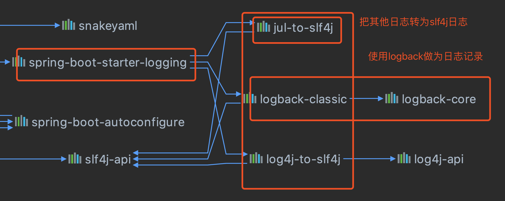
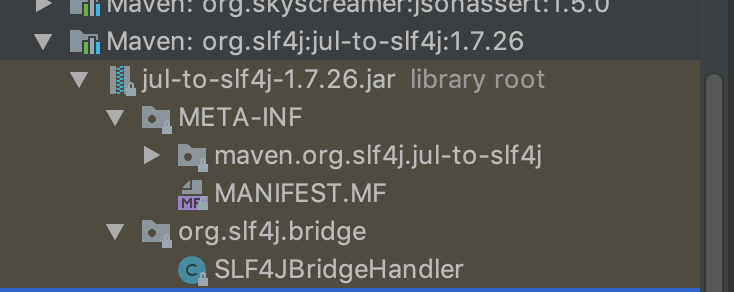

# Spring Boot日志

## 1、日志框架

**Spring Boot：SLF4J（Simple Logging Facade For Java）和logback**

[slf4j官方文档](https://www.slf4j.org/manual.html)

## 2、SLF4J的使用

### 1、如何在系统中使用SLF4J

开发的时候，日志记录方法的调用，不应该直接调用日志的实现类，而是调用日志抽象层里面的方法。

```java
import org.slf4j.Logger;
import org.slf4j.LoggerFactory;

public class HelloWorld {
  public static void main(String[] args) {
    Logger logger = LoggerFactory.getLogger(HelloWorld.class);
    logger.info("Hello World");
  }
}
```


日志的实现框架都有配置文件，使用slf4j，**配置文件写实现日志框架自己本身的配置文件**；

### 2、遗留问题


**所有的日志都统一到slf4j：**

- 将系统中的其他日志框架排除；
- 用中间包替换原有的日志框架；
- 导入slf4j其他的实现日志框架；

## 3、Spring Boot日志关系

```xml
<dependency>
  <groupId>org.springframework.boot</groupId>
  <artifactId>spring-boot-starter</artifactId>
  <version>2.1.4.RELEASE</version>
  <scope>compile</scope>
</dependency>	
```

Spring Boot使用它来做日志功能

```xml
<dependency>
  <groupId>org.springframework.boot</groupId>
  <artifactId>spring-boot-starter-logging</artifactId>
  <version>2.1.4.RELEASE</version>
  <scope>compile</scope>
</dependency>
```

底层依赖关系



总结：

- Spring Boot底层也是使用slf4j+logback的方式进行日志记录

- Spring Boot把其他日志替换成了slf4j

	

- 引入其他框架，一定要把这个框架的默认日志依赖移除掉

Spring Boot能自动适配所有的日志

## 4、日志使用

### 1、默认配置

Spring Boot默认配置好了日志

```java
//记录器
Logger logger = LoggerFactory.getLogger(getClass());
@Test
public void contextLoads() {
    //日志的级别 由低到高：trace<debug<info<warn<error
    //可以调整日志到输出级别
    logger.trace("这是trace日志。。。");
    logger.debug("这是debug日志。。。");
    //Spring Boot默认调整到info级别,root级别
    logger.info("这是info日志。。。");
    logger.warn("这是warn日志。。。");
    logger.error("这是error日志。。。");
}
```

日志输出格式：

```xml
%d{yyyy-MM-dd HH:mm:ss:SSS} [%thread] %-5level %logger{50} - %msg%n
```

- %d：表示日期时间
- %thread：表示线程名
- %-5level：级别从左显示五个字符宽度
- %logger{50}：表示logger名字最长50个字符，否则按照句点分割
- %msg：日志消息
- %n：换行

Spring Boot修改日志的默认配置：

```properties
logging.level.com.allen=trace
#日志输出到设置到文件夹下，使用spring.log做为默认文件
logging.path=/Users/allen/Documents/workSpace/spring-boot/spring-boot-03-logging/src/main/resources/log
#不指定路径就在当前项目下生成springboot.log日志
#可以指定完整到路径
logging.file=springboot.log
#在控制台输出的日志格式
logging.pattern.console=%d{yyyy-MM-dd HH:mm:ss:SSS} [%thread] %-5level %logger{50} - %msg%n
#指定文件中日志输出的格式
logging.pattern.file=%d{yyyy-MM-dd HH:mm:ss:SSS} --- [%thread] --- %-5level --- %logger{50} - %msg%n
```

| `logging.file` | `logging.path` | 例         | 描述                                                         |
| -------------- | -------------- | ---------- | ------------------------------------------------------------ |
| *（没有）*     | *（没有）*     |            | 仅控制台记录。                                               |
| 具体文件       | *（没有）*     | `my.log`   | 写入指定的日志文件。名称可以是精确位置或相对于当前目录。     |
| *（没有）*     | 具体目录       | `/var/log` | 写入`spring.log`指定的目录。名称可以是精确位置或相对于当前目录。 |

### 2、指定配置

给类路径下放上日志框架自己的配置文件即可，Spring Boot就不会使用默认配置

| Logging System          | Customization                                                |
| ----------------------- | ------------------------------------------------------------ |
| Logback                 | `logback-spring.xml`, `logback-spring.groovy`, `logback.xml`, or `logback.groovy` |
| Log4j2                  | `log4j2-spring.xml` or `log4j2.xml`                          |
| JDK (Java Util Logging) | `logging.properties`                                         |

logback.xml：直接被日志框架识别

logback-spring.xml ：日志框架就不直接加载日志的配置项，由Spring Boot加载

```xml
可以指定某个配置只在某个环境下生效
<springProfile name="staging">
	<!-- configuration to be enabled when the "staging" profile is active -->
</springProfile>
```

